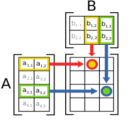
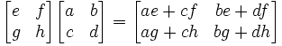
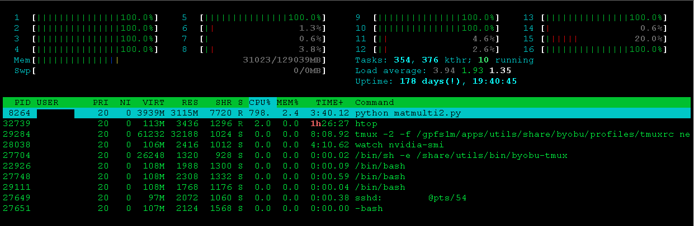

# SWC skills in HPC cluster
We will use simple python script to evaluate a square matrix multiplication using nested loops, Numpy dot function and also advanced Linear Algebra libraries. These scripts and this document are available in GitHub : https://github.com/jordiblasco/swcmeethpc 
### Login
The first of all we will connect to the NeSI Pan cluster via SSH with the following command line:
```
$ ssh user@login.uoa.nesi.org.nz -X -Y
user@login.uoa.nesi.org.nz's password:
Last login: Fri Oct 30 14:11:09 2015 from wifi-staff-172-24-18-229.net.auckland.ac.nz
      *******************************************************************
      **         Welcome to Pan, the NeSI Intel x86-64 Cluster         **
      **                                                               **
      **  This high-performance computing cluster is operated by the   **
      **  University of Auckland Centre for eResearch as part of the   **
      **             New Zealand eScience Infrastructure.              **
      **                                                               **
      *******************************************************************
      For a list of your current projects, run show_my_projects.
      To see your current quota usage, run fs_my_quota_usage.
      For documentation, visit https://wiki.auckland.ac.nz/x/CA-sAg.
      To build or test software, use one of the build nodes:
                ssh build-wm (Westmere)
                ssh build-sb (SandyBridge)
      The next outage is scheduled for 9:00 AM on Thursday 12 November
      2015.
Since we can not run computationally intensive jobs in the login node, we will use one build node.
[login-01 ~]$ ssh build-sb
[build-sb ~]$
```
### GIT clone
Then we will clone the GIT repo from GitHub:
```
[build-sb ~]$ cd SRC/
[build-sb SRC]$ git clone ssh://git@github.com/jordiblasco/swcmeethpc.git
Initialized empty Git repository in /home/user/SRC/swcmeethpc/.git/
remote: Counting objects: 9, done.
remote: Compressing objects: 100% (7/7), done.
remote: Total 9 (delta 0), reused 6 (delta 0), pack-reused 0
Unpacking objects: 100% (9/9), done.
[build-sb SRC]$ cd swcmeethpc/
[build-sb swcmeethpc]$ ls -l
total 160
-rw-r--r-- 1 user nesi  662 Oct 30 14:11 matmulti1.py
-rw-r--r-- 1 user nesi  383 Oct 30 14:11 matmulti2.py
-rw-r--r-- 1 user nesi 1841 Oct 30 14:11 nvblas.conf
-rw-r--r-- 1 user nesi   50 Oct 30 14:11 nvblas.log
-rw-r--r-- 1 user nesi   39 Oct 30 14:11 README.md
```
We will evaluate the performance of the first code using the default Python version installed in the OS.
```
[build-sb swcmeethpc]$ python -V
Python 2.6.6
```
### Square Matrix Multiplication
Reminder : multiplying two N x N (real) matrices requires N multiplications and (N - 1) additions for each element. Since there are N<sup>2</sup> elements in the matrix this yields a total of N<sup>2</sup>(2N - 1) floating-point operations. For large values of N the total number of floating-point operations is around 2N<sup>3</sup>, so the complexity is  O(n<sup>3</sup>).<br>
 <br>
Figure 1 : Schematic diagram of matrix multiplication operation <br>

<br>
Figure 2: Example of square matrix multiplication D=2<br>

More information about computational complexity of mathematical operations available in [Wikipedia](https://en.wikipedia.org/wiki/Computational_complexity_of_mathematical_operations).<br>
### Performance Evaluation
The first code will evaluate a square matrix multiplication of 100x100 real elements using nested for loops. The expected number of floating-point operations is ~ 200<sup>3</sup> = 2M
```
[build-sb swcmeethpc]$ python matmulti1.py
Nested for loops:  63.4096159935
```
**How much time do I need for 1000x1000 elements?**<br>
Number of floating-point operations : ~ 2000<sup>3</sup> = 2000M<br>
We should expect something around 63.410 x 1000 = 63,410s = 17.61h<br>
In this case we will use Numpy dot function to evaluate the same operation but with 1000x1000 matrices
```
[build-sb swcmeethpc]$ python matmulti2.py
Numpy dot function: 73.6630949974
```
**Speed-up** : 63,410 / 73.6 = 861.5<br>
**Using Python 2.7.9 compiled with Intel Compilers and using advanced linear algebra libraries (MKL)**
```
[build-sb swcmeethpc]$ ml Python/2.7.9-intel-2015a
[build-sb swcmeethpc]$ python -V
Python 2.7.9
```
Force to use only **one CPU**<br>
```
[build-sb swcmeethpc]$ export MKL_NUM_THREADS=1
[build-sb swcmeethpc]$ python matmulti2.py
Numpy dot function: 0.886467933655
```
**Speed-up** : 63,410 / 0.886 = 71,568.8<br>
Force to use **four CPUs**
```
[build-sb swcmeethpc]$ export MKL_NUM_THREADS=4
[build-sb swcmeethpc]$ python matmulti2.py
Numpy dot function: 0.257395982742
```
**Speed-up** : 63,410 / 0.257 = 246,731.5<br>
Force to use **eight CPUs**
```
[build-sb swcmeethpc]$ export MKL_NUM_THREADS=8
[build-sb swcmeethpc]$ python matmulti2.py
Numpy dot function: 0.162317037582
```
**Speed-up** : 63,410 / 0.162 = 391,419.8<br>
Force to use only **one CPU and one GPU**
```
[build-sb swcmeethpc]$ export MKL_NUM_THREADS=1
[build-sb swcmeethpc]$ LD_PRELOAD=/share/easybuild/RHEL6.3/sandybridge/software/CUDA/6.5.14/lib64/libnvblas.so python matmulti2.py
Numpy dot function: 0.143069982529
```
**Speed-up** : 63,410 / 0.1431 = 443,116.7<br>

In order to see the load in the compute node, we can increase the parameter N to 10000, and check the load with top or htop.
<br>
Figure 3 : CPU usage in the compute node.
### Update GIT repo
The changes in the Python scripts will be updated in the GitHub repo with the following commands:
```
[build-sb swcmeethpc]$ git add .
[build-sb swcmeethpc]$ git commit -m "updated N to 10000"
[master 9947160] updated N to 10000
 2 files changed, 2 insertions(+), 2 deletions(-)
[build-sb swcmeethpc]$ git push
Enter passphrase for key '/home/user/.ssh/id_rsa_github':
Counting objects: 7, done.
Delta compression using up to 16 threads.
Compressing objects: 100% (4/4), done.
Writing objects: 100% (4/4), 473 bytes, done.
Total 4 (delta 2), reused 0 (delta 0)
To ssh://git@github.com/jordiblasco/swcmeethpc.git
   cca9db1..9947160  master -> master
```
### Submit jobs to batch queue system (Slurm)

```
[jbla572@build-sb swcmeethpc]$ sbatch --reservation=edu example-01.sl
Submitted batch job 27482478
[jbla572@build-sb swcmeethpc]$ sbatch --reservation=edu example-02.sl
Submitted batch job 27482479
[jbla572@build-sb swcmeethpc]$ sbatch --reservation=edu example-03.sl
Submitted batch job 27482480
[jbla572@build-sb swcmeethpc]$ sbatch --reservation=edu example-04.sl
Submitted batch job 27482481
[jbla572@build-sb swcmeethpc]$ sbatch --reservation=edu --cpus-per-task=8 example-04.sl
Submitted batch job 27482482
[jbla572@build-sb swcmeethpc]$ sbatch --reservation=edu --cpus-per-task=16 example-04.sl
Submitted batch job 27482483
[jbla572@build-sb swcmeethpc]$ sbatch --reservation=edu example-05.sl
Submitted batch job 27482484
[jbla572@build-sb swcmeethpc]$ squ
             JOBID PARTITION PRIOR     NAME     USER    STATE       TIME  TIME_LIMIT  NODES CPUS   GRES           START_TIME     NODELIST(REASON)      QOS
          27482478     merit 41000 DefaultS  jbla572  PENDING       0:00        5:00      1    1 (null)                  N/A        (Reservation)   normal
          27482479     merit 41000 DefaultS  jbla572  PENDING       0:00        5:00      1    1 (null)                  N/A        (Reservation)   normal
          27482480     merit 41000 TunedVer  jbla572  PENDING       0:00        5:00      1    1 (null)                  N/A        (Reservation)   normal
          27482481     merit 41000 TunedVer  jbla572  PENDING       0:00        5:00      1    4 (null)                  N/A        (Reservation)   normal
          27482482     merit 41000 TunedVer  jbla572  PENDING       0:00        5:00      1    8 (null)                  N/A        (Reservation)   normal
          27482483     merit 41000 TunedVer  jbla572  PENDING       0:00        5:00      1   16 (null)                  N/A        (Reservation)   normal
          27482484     merit 41000 GPUVersi  jbla572  PENDING       0:00        5:00      1    1  gpu:1                  N/A        (Reservation)   normal

7 job(s) queued, 7 pending, 0 running, 0 suspended
```
